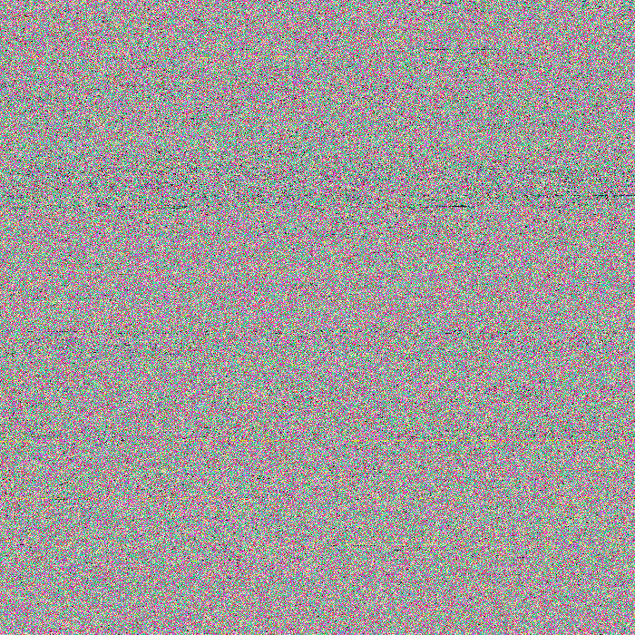
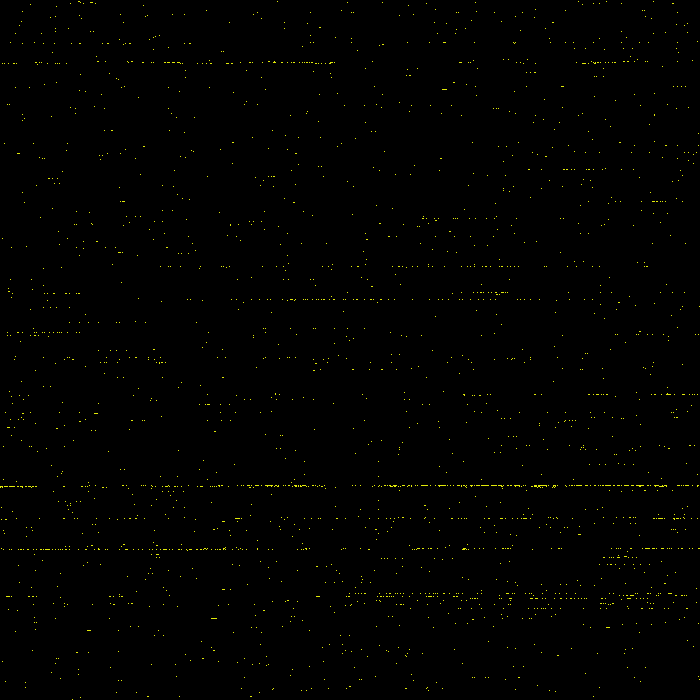

# DNA--PNG
Fun project that transforms a 23andMe DNA report into a (not so good looking) beaufitul image. The program first orders all the genotypes by their position(see below) then it proceeds to generate a cambas as x and y being (x * y) = length(*list of all genotypes*) or srt(length(*list of all genotypes*)) for both x and y. Each genotype can be assigned an specific color, then for each pixel in the canvas we paint it with the corresponding genotype.

## Input
The layout report is in the following format (23andMe):
```
rsid            chromosome	    position	genotype
rs548049170     1                   69869       TT
...
```
Note: To play around with this data we provide functions to turn it into a JSON file. 
```json
"1": {
  "rs548049170": {
      "genotype": "TT",
      "position": "69869"
  }
}
 ```
 ## Color Selection
We can select a different color per each genotype present in the input. For example:
```json
{
  "CC": {
    "r":255,
    "g":210,
    "b":170
  },
  "A": {
    "r":16,
    "g":215,
    "b":162
  },
  ...
}
 ```
 
## How to run
Running this command should give you a full canvas painted with your DNA.
```terminal
python main.py /example/genome_v5_Full_20190120081726.txt
```


You can also select a genotype in specific to be painted. For example (note the II for genotype. You can also add more than one):
```terminal
python main.py /example/genome_v5_Full_20190120081726.txt II 

```

